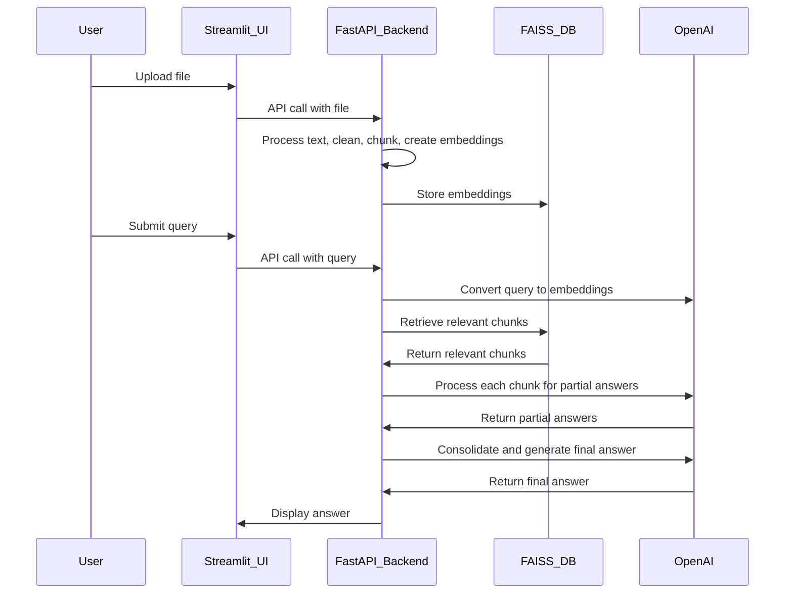

# Streamlit & FastAPI-based Document Processing and Query System

This project provides an interactive system for processing documents, storing processed data in a FAISS database, and querying it using an OpenAI large language model (LLM). The architecture leverages Streamlit for the frontend, FastAPI for the backend, and OpenAI for embedding and answering user queries.

---

## **Features**

1. **File Upload and Processing**:
   - User uploads a file through a UI built with Streamlit.
   - The file is processed by an API endpoint which reads the text, cleans it, and chunks it into overlapping segments using LangChain’s recursive splitting.

2. **Embedding and Storage**:
   - Each chunk is converted into embeddings using OpenAI embeddings.
   - The embeddings are stored in a FAISS (Facebook AI Similarity Search) database for efficient retrieval.

3. **Query Handling**:
   - The user submits a query through the Streamlit UI.
   - The query is processed and converted into embeddings by an API endpoint.
   - Relevant chunks are retrieved from the FAISS database.
   - Each retrieved chunk is passed to the OpenAI LLM for generating partial answers.

4. **Final Answer Generation**:
   - Partial answers from all chunks are consolidated and passed to the LLM.
   - The final answer is returned to the Streamlit UI for display.

---

## **Architecture Diagram**



---

## **Technologies Used**

- **Frontend**: Streamlit
- **Backend**: FastAPI
- **Database**: FAISS for storing and retrieving embeddings
- **Embeddings and LLM**: OpenAI
- **Text Processing**: LangChain

---

## **How It Works**

1. **File Upload**:
   - Users upload a PDF or text document through the Streamlit UI.
   - The file is sent to the backend API for processing.

2. **Text Processing**:
   - The API reads the file content and performs data cleaning.
   - The cleaned text is divided into chunks using LangChain’s recursive text splitter, ensuring overlaps for context retention.

3. **Embedding Generation**:
   - Each chunk is converted into embeddings using OpenAI embeddings API.
   - The embeddings are stored in FAISS for fast and scalable similarity search.

4. **Query Processing**:
   - The user’s query is sent to the backend API.
   - The API converts the query into embeddings and retrieves relevant document chunks from the FAISS database.

5. **Answer Retrieval**:
   - Each retrieved chunk is passed to the OpenAI LLM for generating partial answers.
   - All partial answers are combined and passed back to the LLM for final answer generation.

6. **Answer Display**:
   - The final answer is sent to the Streamlit UI for user consumption.

---

## **Setup Instructions**

1. Clone the repository:
   ```bash
   git clone https://github.com/TEJA0811/genAI-project-basic.git
   cd genAI-project-basic
   ```

2. Install dependencies:
   ```bash
   pip install -r requirements.txt
   ```

3. Set up environment variables in a `.env` file:
   ```plaintext
   OPENAI_API_KEY=your_openai_api_key
   FAISS_DIR=path_to_faiss_directory
   UPLOAD_DIR=path_to_upload_directory
   ```

4. Start the backend server:
   ```bash
   uvicorn app.main:app --reload
   ```

5. Start the frontend:
   ```bash
   streamlit run app/ui.py
   ```

6. Access the application at `http://localhost:8501`.

---

## **Future Improvements**

- Support for additional file formats (e.g., Word documents, HTML).
- Integration with other embedding models for flexibility.
- Enhanced chunking strategies for better context.
- Improved UI for displaying sources and explanations.

---


